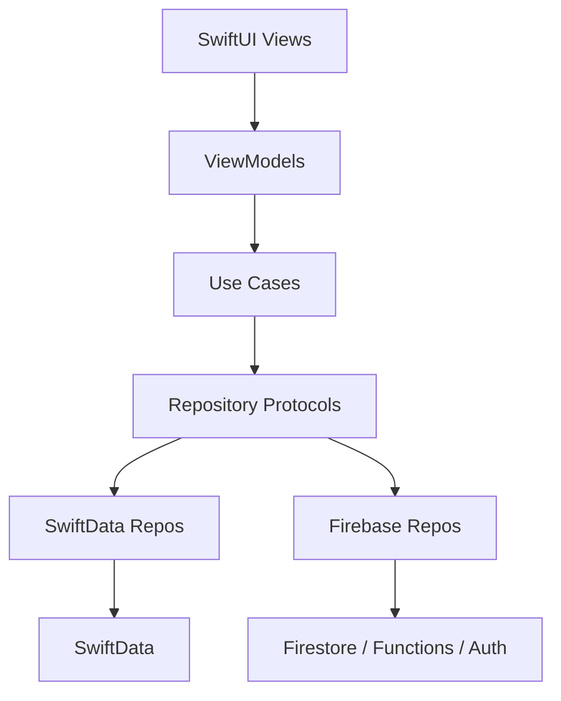

# EMBERA

<p align="center">
  
</p>

<p align="center">
  <strong>Premium iOS coffee ritual with cinematic motion and zero friction.</strong><br/>
  <em>Dark glass, warm light, generous space, and spring physics.</em>
</p>

<p align="center">
  
  
  
  
  
</p>

<p align="center">
  
  
  
  
  
  
</p>

<p align="center">
  
  
  
  
  
</p>

<table align="center">
  <tr>
    <td align="center"><strong>Onboarding</strong><br/>Ambient parallax and matched geometry.</td>
    <td align="center"><strong>Browse</strong><br/>Coverflow, glass cards, snap carousels.</td>
    <td align="center"><strong>Checkout</strong><br/>Bottom sheet with Apple Pay.</td>
  </tr>
</table>

> Note: This public repo is documentation-only. The file paths below map to the full EMBERA codebase.

---

## Table of Contents
- [Vision](#vision)
- [Brand Board](#brand-board)
- [Design Language](#design-language)
- [Tech Stack Wall](#tech-stack-wall)
- [Experience Map](#experience-map)
- [Feature Set](#feature-set)
- [Motion and Haptics](#motion-and-haptics)
- [Scrolling System](#scrolling-system)
- [Architecture](#architecture)
- [Project Structure](#project-structure)
- [App Flow](#app-flow)
- [Data Flow](#data-flow)
- [Design System](#design-system)
- [Core Technologies](#core-technologies)
- [App State and Routing](#app-state-and-routing)
- [Dependency Injection](#dependency-injection)
- [Domain Models](#domain-models)
- [Checkout Pipeline](#checkout-pipeline)
- [Rewards Logic](#rewards-logic)
- [Order Tracking Logic](#order-tracking-logic)
- [Passkey Backend Contract](#passkey-backend-contract)
- [Firestore Data Model](#firestore-data-model)
- [Security and Privacy](#security-and-privacy)
- [Performance](#performance)
- [Accessibility](#accessibility)
- [Build Variants](#build-variants)
- [Seed Data](#seed-data)
- [Backend](#backend)
- [Setup](#setup)
- [Key IDs](#key-ids)
- [Important UI Files](#important-ui-files)
- [Architecture Diagram](#architecture-diagram)
- [Full File Map](#full-file-map)
- [QA Test Plan](#qa-test-plan)
- [Cinematic UI Blueprint](#cinematic-ui-blueprint)
- [Developer Playbook](#developer-playbook)
- [Stability Rules](#stability-rules)
- [Troubleshooting](#troubleshooting)
- [Release Checklist](#release-checklist)
- [Why These Choices Matter](#why-these-choices-matter)

---

## Vision
EMBERA is a ritual engine. Not a simple shop, but a cinematic coffee journey.
Every interaction feels calm, warm, and intentional.

---

## Brand Board
Palette and material tokens:

<p>
  
  
  
  
  
</p>

Material spec:
- Surface: #0B0908
- Elevation: #1F1A17
- Glass: #2B2522 at 55% opacity with a 1px stroke #3A322D
- Highlight: #FF6A3D glow at 8% intensity
- Text: #F6EFE8

Typography:
- Display: New York (serif, tight tracking)
- Body: SF Pro Rounded (calm, friendly, high legibility)

---

## Design Language
Cinematic blueprint:
- Dark surfaces plus soft highlights
- Glass layers with subtle borders
- Serif display type plus rounded body type
- Motion as communication, never decoration
- Haptics that feel warm, not loud

---

## Tech Stack Wall
<table align="center">
  <tr>
    <td align="center"><br/>Swift 6</td>
    <td align="center"><br/>SwiftUI</td>
    <td align="center"><br/>SwiftData</td>
    <td align="center"><br/>Firebase</td>
    <td align="center"><br/>Cloud Functions</td>
    <td align="center"><br/>TypeScript</td>
  </tr>
</table>

---

## Experience Map
| Stage | Emotion | Motion | Haptics |
| --- | --- | --- | --- |
| Onboarding | Calm welcome | Parallax hero, matched geometry | Soft selection on page change |
| Home | Warm focus | Ambient drift, glass blur, snap carousel | Subtle tick on card focus |
| Product | Control | Drag gestures, spring response | Soft impact on add-to-cart |
| Checkout | Confidence | Bottom sheet, Apple Pay sheet | Success pulse on payment |
| Tracking | Reassurance | Live Activity timeline | Light update tick |

---

## Feature Set
- Emotional onboarding
- Passkeys plus Face ID sessions
- Immersive home with ambient depth
- Cinematic product browsing and customization
- Bottom sheet cart with Apple Pay
- Loyalty and rewards
- Store locator (MapKit)
- Live order tracking (Live Activities)
- Widgets for rewards and orders

---

## Motion and Haptics
Motion tokens:
- Spring: response 0.55, damping 0.86, blend 0.12
- Fast ease: 0.18s, easeOut
- Slow ease: 0.60s, easeInOut
- Ambient drift: 16s loop, 0.02 vertical offset

Haptics:
- Selection feedback on navigation
- Soft impact on add-to-cart and reward redeem
- Success on Apple Pay completion

Files:
- EMBERA/Core/Motion/EmberaMotion.swift
- EMBERA/Core/Motion/HapticEngine.swift

---

## Scrolling System
- Momentum tuned with .scrollTargetBehavior(.viewAligned) for carousels
- ParallaxHeader uses GeometryReader and minY offsets (0.35 parallax ratio)
- CoverflowCarousel uses rotation3DEffect plus scale interpolation
- Sticky segments use safeAreaInset with ultra-thin material
- Nested scroll relies on named coordinateSpace to avoid gesture conflicts

---

## Architecture
Clean Architecture plus MVVM. UI never speaks directly to data sources.



Key principle: Local-first. Network failure never blocks checkout.

---

## Project Structure
```
EMBERA/
  App/                     App entry + routing + DI
  Core/                    Design system, motion, security, widgets
  Data/                    Repositories, storage, payments, seeds
  Domain/                  Models, use cases, repository protocols
  Features/                SwiftUI screens + view models
  Extensions/              Widget + Live Activity targets
  Backend/Firebase/        Cloud Functions + Firestore rules
```

---

## App Flow
1) Onboarding
2) Passkey auth
3) Biometric lock
4) Home
5) Browse plus product detail customization
6) Cart bottom sheet
7) Apple Pay checkout
8) Rewards and loyalty
9) Live order tracking
10) Store locator

---

## Data Flow
Local-first architecture:
- SwiftData for cart, orders, and loyalty
- Remote Firebase sync is best-effort only

Remote layer activates when Firebase SDKs are present:
- RemoteAuthRepository via Functions plus FirebaseAuth
- FirebaseOrderRepository per-user orders
- FirebaseLoyaltyRepository per-user loyalty

---

## Design System
Core styles in EMBERA/Core/DesignSystem/:
- EmberaColors, EmberaTypography, EmberaTheme, EmberaSpacing

Core components in EMBERA/Core/Components/:
- GlassCard, EmberaPrimaryButton, chips, steppers, search field

Motion utilities in EMBERA/Core/Motion/:
- EmberaMotion
- ParallaxHeader
- CoverflowCarousel

---

## Core Technologies
- SwiftUI plus async/await
- SwiftData local persistence
- Firebase Auth plus Firestore plus Functions
- Apple Pay, Passkeys, Face ID
- MapKit, Widgets, Live Activities
- Core Haptics

---

## App State and Routing
Routing logic lives in EMBERA/App/RootView.swift.

Order of gates:
1) Onboarding
2) Passkey auth
3) Biometric lock
4) Main tabs

State lives in EMBERA/App/AppState.swift:
- hasCompletedOnboarding
- selectedTab
- isCartPresented
- userDisplayName

---

## Dependency Injection
AppContainer builds all repositories and view models:
- Local repos use SwiftData
- Remote repos use Firebase when SDKs are available
- Feature view models are shared across tabs

File: EMBERA/App/AppContainer.swift

---

## Domain Models
Key models:
- Product, CartItem, CartSummary, Order
- LoyaltyAccount, RewardOffer, RewardTier
- StoreLocation, UserSession

Files in EMBERA/Domain/Models/

---

## Checkout Pipeline
Flow:
1) Cart summary built (PaymentSummaryBuilder)
2) Apple Pay auth (ApplePayService)
3) Order created (Order)
4) Persist locally (LocalOrderRepository)
5) Remote sync (best-effort)
6) Loyalty update (ApplyOrderLoyaltyUseCase)
7) Live Activity start (OrderLiveActivityManager)
8) Widget snapshot saved (WidgetDataStore)

---

## Rewards Logic
Points engine:
- LoyaltyEngine.points(for:) = subtotal * 10

Tier thresholds:
- Ember: 0
- Aura: 500
- Halo: 1200

Files:
- EMBERA/Domain/Services/LoyaltyEngine.swift
- EMBERA/Domain/Models/RewardTier.swift

---

## Order Tracking Logic
Deterministic timeline:
- Processing: 15 min
- Roasting: 45 min
- Shipping: rest of ETA window

File: EMBERA/Features/Orders/OrderStatusTimeline.swift

---

## Passkey Backend Contract
Functions are callable endpoints:

- registerBegin
  - request: displayName
  - response: uid, challenge, userID, rpID, rpName
- registerFinish
  - request: uid, credential
  - response: uid, displayName, memberSince, customToken
- signInBegin
  - request: none
  - response: challengeID, challenge, rpID
- signInFinish
  - request: challengeID, credential
  - response: uid, displayName, memberSince, customToken

File: EMBERA/Backend/Firebase/functions/src/index.ts

---

## Firestore Data Model
Collections:
- users/{uid}
- users/{uid}/credentials/{credentialID}
- orders/{orderId}
- webauthnChallenges/{challengeId}

Rules in EMBERA/Backend/Firebase/firestore.rules

---

## Security and Privacy
- Passkeys require Associated Domains plus AASA file
- Firestore rules restrict by request.auth.uid
- Custom tokens generated server-side only
- Keychain stores local session

---

## Performance
- LazyVStack for lists
- TimelineView updates only when needed
- Local-first persistence to avoid UI stalls

---

## Accessibility
- VoiceOver labels on critical UI
- Combine accessibility elements in cards
- Test with Larger Text and Reduce Motion

---

## Build Variants
- Firebase SDKs present: remote auth plus sync
- Firebase SDKs absent: local-only experience

---

## Seed Data
Seed content lives in:
- EMBERA/Data/Seed/SeedProducts.swift
- EMBERA/Data/Seed/SeedStores.swift

---

## Backend
Backend lives in EMBERA/Backend/Firebase and provides:
- Passkey verification
- Firebase Auth custom tokens
- Firestore storage for loyalty and orders

Full setup steps are in EMBERA/Backend/Firebase/README.md

---

## Setup
### Prerequisites
- Xcode 15+
- iOS 17+ device
- Firebase project
- Associated domain for passkeys
- Apple Pay merchant ID

### Add Firebase SDKs
Via Swift Package Manager:
- FirebaseAuth
- FirebaseFirestore
- FirebaseFunctions
- FirebaseCore

Add GoogleService-Info.plist to app target.

### Deploy backend
From EMBERA/Backend/Firebase:
```
firebase login
firebase use <project-id>
firebase functions:config:set embera.rp_id="embera.coffee" embera.origin="https://embera.coffee" embera.rp_name="EMBERA"
firebase deploy --only functions,firestore:rules,firestore:indexes
```

### Xcode Capabilities
- Associated Domains: webcredentials:embera.coffee
- Apple Pay: merchant.com.embera.coffee
- App Groups: group.com.embera
- Live Activities

### AASA file
Host /.well-known/apple-app-site-association at your domain and include
Team ID plus bundle ID in webcredentials.apps.

---

## Key IDs
- Apple Pay merchant ID:
  EMBERA/App/AppContainer.swift
  default = merchant.com.embera.coffee
- App Group:
  EMBERA/Core/Widgets/WidgetDataStore.swift
  default = group.com.embera
- Relying Party ID (passkeys):
  EMBERA/Data/Repositories/LocalAuthRepository.swift
  default = embera.coffee
- Firebase config:
  GoogleService-Info.plist

---

## Important UI Files
- Home: EMBERA/Features/Home/HomeView.swift
- Browse: EMBERA/Features/Catalog/CatalogView.swift
- Detail: EMBERA/Features/ProductDetail/ProductDetailView.swift
- Cart: EMBERA/Features/Cart/CartView.swift
- Rewards: EMBERA/Features/Rewards/RewardsView.swift
- Tracking: EMBERA/Features/Orders/OrderTrackingView.swift
- Stores: EMBERA/Features/Stores/StoresView.swift
- Onboarding: EMBERA/Features/Onboarding/OnboardingView.swift

---

## Architecture Diagram
```
[SwiftUI Views]
      |
  [ViewModels]
      |
   [Use Cases]
      |
[Repository Protocols]
   /            \
[SwiftData]   [Firebase]
    \            /
  [Composite Repos]
      |
[Core Services]
```

---

## Full File Map
```
EMBERA/README.md
EMBERA/App/EMBERAApp.swift
EMBERA/App/AppContainer.swift
EMBERA/App/AppState.swift
EMBERA/App/MainTabView.swift
EMBERA/App/RootView.swift

EMBERA/Core/Components/AmbientBackground.swift
EMBERA/Core/Components/ApplePayButton.swift
EMBERA/Core/Components/CartFloatingButton.swift
EMBERA/Core/Components/EmberaButton.swift
EMBERA/Core/Components/EmberaSearchField.swift
EMBERA/Core/Components/GlassCard.swift
EMBERA/Core/Components/OptionCard.swift
EMBERA/Core/Components/OptionChip.swift
EMBERA/Core/Components/QuantityStepper.swift
EMBERA/Core/Components/TastingNoteChip.swift

EMBERA/Core/DesignSystem/EmberaColors.swift
EMBERA/Core/DesignSystem/EmberaSpacing.swift
EMBERA/Core/DesignSystem/EmberaTheme.swift
EMBERA/Core/DesignSystem/EmberaTypography.swift
EMBERA/Core/DesignSystem/ProductTone+Palette.swift

EMBERA/Core/LiveActivity/OrderActivityAttributes.swift
EMBERA/Core/LiveActivity/OrderLiveActivityManager.swift

EMBERA/Core/Motion/CoverflowCarousel.swift
EMBERA/Core/Motion/EmberaMotion.swift
EMBERA/Core/Motion/HapticEngine.swift
EMBERA/Core/Motion/ParallaxHeader.swift

EMBERA/Core/Network/AuthAPIClient.swift
EMBERA/Core/Network/Base64URL.swift
EMBERA/Core/Network/FirebaseAuthService.swift

EMBERA/Core/Security/BiometricService.swift
EMBERA/Core/Security/KeychainStore.swift
EMBERA/Core/Security/PasskeyService.swift

EMBERA/Core/Utilities/EmberaCoders.swift
EMBERA/Core/Utilities/EmberaCurrency.swift

EMBERA/Core/Widgets/WidgetDataStore.swift

EMBERA/Data/Payments/ApplePayService.swift
EMBERA/Data/Remote/FirebaseBootstrap.swift
EMBERA/Data/Seed/SeedProducts.swift
EMBERA/Data/Seed/SeedStores.swift
EMBERA/Data/Storage/AppModelContainer.swift
EMBERA/Data/Storage/CartItemRecord+Domain.swift
EMBERA/Data/Storage/CartItemRecord.swift
EMBERA/Data/Storage/LoyaltyAccountRecord+Domain.swift
EMBERA/Data/Storage/LoyaltyAccountRecord.swift
EMBERA/Data/Storage/OrderRecord+Domain.swift
EMBERA/Data/Storage/OrderRecord.swift
EMBERA/Data/Storage/ProductRecord.swift

EMBERA/Data/Repositories/CartRepositoryError.swift
EMBERA/Data/Repositories/CompositeOrderRepository.swift
EMBERA/Data/Repositories/FirebaseLoyaltyRepository.swift
EMBERA/Data/Repositories/FirebaseOrderRepository.swift
EMBERA/Data/Repositories/LocalAuthRepository.swift
EMBERA/Data/Repositories/LocalCartRepository.swift
EMBERA/Data/Repositories/LocalLoyaltyRepository.swift
EMBERA/Data/Repositories/LocalOrderRepository.swift
EMBERA/Data/Repositories/LocalProductRepository.swift
EMBERA/Data/Repositories/LocalStoreRepository.swift
EMBERA/Data/Repositories/LoyaltyRepositoryError.swift
EMBERA/Data/Repositories/OrderRepositoryError.swift
EMBERA/Data/Repositories/RemoteAuthRepository.swift

EMBERA/Domain/Models/BagSize.swift
EMBERA/Domain/Models/BiometricType.swift
EMBERA/Domain/Models/BrewStyle.swift
EMBERA/Domain/Models/CartItem.swift
EMBERA/Domain/Models/CartSummary.swift
EMBERA/Domain/Models/Category.swift
EMBERA/Domain/Models/GrindSize.swift
EMBERA/Domain/Models/LoyaltyAccount.swift
EMBERA/Domain/Models/Order.swift
EMBERA/Domain/Models/OrderStatus.swift
EMBERA/Domain/Models/Product.swift
EMBERA/Domain/Models/ProductTone.swift
EMBERA/Domain/Models/RewardOffer.swift
EMBERA/Domain/Models/RewardTier.swift
EMBERA/Domain/Models/RoastLevel.swift
EMBERA/Domain/Models/StoreLocation.swift
EMBERA/Domain/Models/SubscriptionInterval.swift
EMBERA/Domain/Models/UserSession.swift

EMBERA/Domain/Repositories/AuthRepository.swift
EMBERA/Domain/Repositories/CartRepository.swift
EMBERA/Domain/Repositories/LoyaltyRepository.swift
EMBERA/Domain/Repositories/OrderRepository.swift
EMBERA/Domain/Repositories/ProductRepository.swift
EMBERA/Domain/Repositories/StoreRepository.swift

EMBERA/Domain/Services/LoyaltyEngine.swift

EMBERA/Domain/UseCases/AddToCartUseCase.swift
EMBERA/Domain/UseCases/ApplyOrderLoyaltyUseCase.swift
EMBERA/Domain/UseCases/ClearCartUseCase.swift
EMBERA/Domain/UseCases/GetBiometricLockStateUseCase.swift
EMBERA/Domain/UseCases/GetBiometricTypeUseCase.swift
EMBERA/Domain/UseCases/LoadAllProductsUseCase.swift
EMBERA/Domain/UseCases/LoadCartUseCase.swift
EMBERA/Domain/UseCases/LoadFeaturedProductsUseCase.swift
EMBERA/Domain/UseCases/LoadLoyaltyAccountUseCase.swift
EMBERA/Domain/UseCases/LoadRecentOrdersUseCase.swift
EMBERA/Domain/UseCases/LoadSessionUseCase.swift
EMBERA/Domain/UseCases/LoadStoresUseCase.swift
EMBERA/Domain/UseCases/PlaceOrderUseCase.swift
EMBERA/Domain/UseCases/RedeemRewardUseCase.swift
EMBERA/Domain/UseCases/RegisterPasskeyUseCase.swift
EMBERA/Domain/UseCases/RemoveCartItemUseCase.swift
EMBERA/Domain/UseCases/SetBiometricLockUseCase.swift
EMBERA/Domain/UseCases/SignInUseCase.swift
EMBERA/Domain/UseCases/SignOutUseCase.swift
EMBERA/Domain/UseCases/UnlockWithBiometricsUseCase.swift
EMBERA/Domain/UseCases/UpdateCartItemUseCase.swift

EMBERA/Extensions/EmberaWidgets/EmberaWidgets.swift
EMBERA/Extensions/EmberaWidgets/OrderLiveActivityWidget.swift
EMBERA/Extensions/EmberaWidgets/RewardsWidget.swift

EMBERA/Features/Auth/AuthViewModel.swift
EMBERA/Features/Auth/AuthenticationView.swift
EMBERA/Features/Auth/BiometricLockView.swift
EMBERA/Features/Cart/CartView.swift
EMBERA/Features/Cart/CartViewModel.swift
EMBERA/Features/Catalog/CatalogHeaderView.swift
EMBERA/Features/Catalog/CatalogView.swift
EMBERA/Features/Catalog/CatalogViewModel.swift
EMBERA/Features/Checkout/CheckoutViewModel.swift
EMBERA/Features/Checkout/PaymentSummaryBuilder.swift
EMBERA/Features/Home/CategoryChipsView.swift
EMBERA/Features/Home/FeaturedCarouselView.swift
EMBERA/Features/Home/HomeHeaderView.swift
EMBERA/Features/Home/HomeHeroView.swift
EMBERA/Features/Home/HomeView.swift
EMBERA/Features/Home/HomeViewModel.swift
EMBERA/Features/Home/ProductCardView.swift
EMBERA/Features/Onboarding/OnboardingView.swift
EMBERA/Features/Onboarding/OnboardingViewModel.swift
EMBERA/Features/Orders/OrderStatusTimeline.swift
EMBERA/Features/Orders/OrderTrackingView.swift
EMBERA/Features/Orders/OrdersViewModel.swift
EMBERA/Features/ProductDetail/ProductDetailView.swift
EMBERA/Features/ProductDetail/ProductDetailViewModel.swift
EMBERA/Features/Rewards/RewardsView.swift
EMBERA/Features/Rewards/RewardsViewModel.swift
EMBERA/Features/Stores/StoresView.swift
EMBERA/Features/Stores/StoresViewModel.swift

EMBERA/Backend/Firebase/README.md
EMBERA/Backend/Firebase/firebase.json
EMBERA/Backend/Firebase/firestore.indexes.json
EMBERA/Backend/Firebase/firestore.rules
EMBERA/Backend/Firebase/functions/package.json
EMBERA/Backend/Firebase/functions/tsconfig.json
EMBERA/Backend/Firebase/functions/src/index.ts
```

---

## QA Test Plan
Core journeys:
- Onboarding: swipe, skip, enter
- Passkey create: new user, cancel, retry
- Passkey sign-in: existing user, cancel, retry
- Biometric lock: background/foreground lock, unlock
- Browse: search, filter, select
- Product detail: grind, bag, brew changes
- Cart: quantity edit, remove, empty
- Apple Pay: success, cancel, no card
- Rewards: points update, redeem
- Orders: tracking timeline updates
- Live Activity: start, update, end
- Widgets: rewards plus order snapshots
- Stores: map selection, directions, call

Edge cases:
- Offline checkout
- Firebase auth expired
- No biometric hardware
- System time changed

---

## Cinematic UI Blueprint
Think "warm spacecraft cockpit":
- Ambient gradient background
- Glass surfaces with faint borders
- Slow parallax on headers
- Spring-based transitions
- Haptic pulses for meaningful moments

---

## Developer Playbook
Add a new screen:
1) Create view in EMBERA/Features/<FeatureName>/
2) Create ViewModel with use cases
3) Inject in AppContainer
4) Route in MainTabView or NavigationStack

Add a new data source:
1) Define repository protocol in Domain/Repositories
2) Implement repos in Data/Repositories
3) Inject into use cases

Add a reward offer:
- Update RewardOffer.catalog in Domain/Models/RewardOffer.swift

---

## Stability Rules
- Checkout must never fail because of network
- Passkey auth must work without password fallback
- UI must stay responsive at 120Hz
- Live Activity must end when delivered
- Widget updates must be lightweight

---

## Troubleshooting
- Passkeys not showing:
  - Check Associated Domains plus AASA file
  - Verify rp_id and origin in Functions config
- Apple Pay not available:
  - Check merchant ID and entitlements
  - Must be on real device
- Widgets not updating:
  - App Group ID mismatch
  - Widget target missing
- Firebase errors:
  - SDKs missing or GoogleService-Info.plist not in target

---

## Release Checklist
- Firebase SDKs added and configured
- Functions deployed plus rules plus indexes
- AASA file live
- Apple Pay merchant ID verified
- Widget target configured
- App Group ID matches code
- Real device testing completed

---

## Why These Choices Matter
EMBERA is designed to feel premium and effortless:
local-first persistence avoids friction,
passkeys remove password pain,
motion leads the eye,
and Live Activities keep the ritual alive beyond the app.

---

If you want a deeper dive or a visual style guide PDF, say the word.
